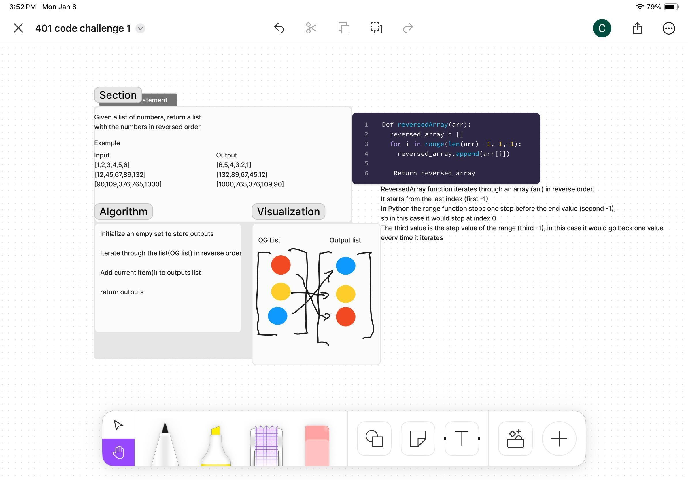

# Array Reverse
Write a function called reverseArray which takes an array as an argument. Without utilizing any of the built-in methods available to your language, return an array with elements in reversed order.

## Whiteboard Process

## Approach & Efficiency
<!-- What approach did you take? Why? What is the Big O space/time for this approach? -->
First I created an empty array to store the outputs I would get. Then I used a for loop to iterate through an a array in reverse order using the range function with 3 parameters, starting point, end point, and iterator. The current value in the for loop would then get added (.append) to the empty array. Finally I return the new Array with the values of the original array in reverse order.
Big 0:
    time: 0(n) - current changed once for each iteration in a for loop
    space: 0(n) - newArray added one copy of each item

## Solution
def reverseArray(arr):
   
    reversed_arr = []

    for i in range(len(arr) - 1, -1, -1):
        reversed_arr.append(arr[i])

    return reversed_arr

# Example usage
example_array = [1, 2, 3, 4, 5]
reversed_example = reverseArray(example_array)
reversed_example
expected result = [5,4,3,2,1]

