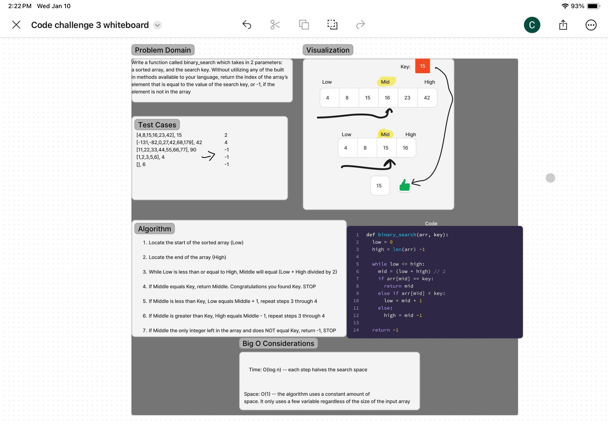

# Array Binary Search
Write a function called BinarySearch which takes in 2 parameters: a sorted array and the search key. Without utilizing any of the built-in methods available to your language, return the index of the array’s element that is equal to the value of the search key, or -1 if the element is not in the array.

## Whiteboard Process

## Approach & Efficiency
<!-- What approach did you take? Why? What is the Big O space/time for this approach? -->
I used a one row table to represent the sorted array. Then halved the numbers in the table in each "search" until the last remaining number was equal to the key. If the key was not found in the array, I returned -1.

Locate start (low) and end (high) of the sorted array.
If low is less than or equal to high, then mid is low + high / 2
If mid is equal to key, return key
If mid is less than key, low is than equal to mid + 1 to ignore the first half
If mid is greater than key, high is then equal to high -1 to ignore the second half
Repeat steps until key is found or return -1 if not found

Big O considerations:
Time: O(log n)--  Each step of the binary search halves the search space

Space: O(n)-- Uses a constant amount of space. The algorithm only uses a few variables (low, high, mid) regardless of the size of the input array

## Solution

def binary_search(arr, key):
  
    low = 0
    high = len(arr) - 1

    while low <= high:
        mid = (low + high) // 2

        if arr[mid] == key:
            return mid
       
        elif arr[mid] < key:
            low = mid + 1
     
        else:
            high = mid - 1

    return -1

# Test the function with the provided examples

# Example usage
[4, 8, 15, 16, 23, 42], 15	--------------->  2
[-131, -82, 0, 27, 42, 68, 179], 42	 ------> 4
[11, 22, 33, 44, 55, 66, 77], 90 ----------> -1
[1, 2, 3, 5, 6, 7], 4 --------------------->-1