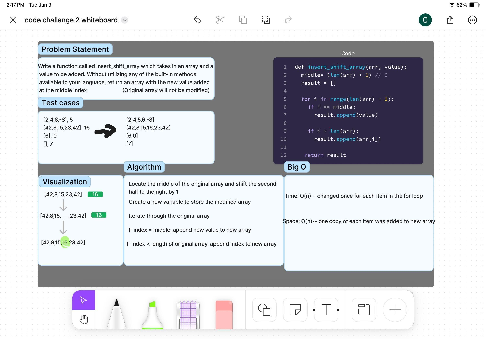

# Array Insert Shift
Write a function called insertShiftArray which takes in an array and a value to be added. Without utilizing any of the built-in methods available to your language, return an array with the new value added at the middle index.

## Whiteboard Process

## Approach & Efficiency
<!-- What approach did you take? Why? What is the Big O space/time for this approach? -->
Locate the middle index (middle) of the array and shifting the second half to the right by 1 by using len(array)+1//2
Create a new array (result) to store result in
Using a for loop, iterate through the original array storing the copies into the new array and using a conditional if statement to check if the current index is equal to middle than append the item to be added to the new result array in the appropriate spot

Big O considerations:
Time: O(n)-- current index changed once for each item in the for loop
Space: O(n)-- one copy of each item in the original array was added the the result array and 1 value was added to the middle

## Solution
def insert_shift_array(arr, value):
    middle = (len(arr) + 1) // 2
    result = []
    for i in range(len(arr) + 1):
        if i == middle:
            result.append(value)
        if i < len(arr):
            result.append(arr[i])

    return result

# Test the function with the provided examples

# Example usage
insert_shift_array([2, 4, 6, -8], 5)   Output: [2, 4, 5, 6, -8]
insert_shift_array([42, 8, 15, 23, 42], 16)   Output: [42, 8, 15, 16, 23, 42]