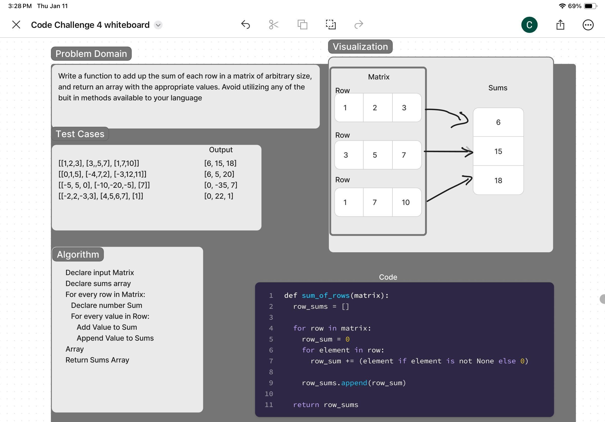

# Array Matrix Sum

Write a function to add up the sum of each row in a matrix of arbitrary size, and return an array with the appropriate values.
Avoid utilizing any of the built-in methods available to your language.
The matrix will always be full of integers.
Negative values are possible.
All nulls will be counted as zeros.

## Whiteboard Process

## Approach & Efficiency

Identify the problem domain
Establish test cases
Write algorithm
Sketch out visualization using table rows
Code

## Solution

def sum_of_rows(matrix):
   
    row_sums = []

    for row in matrix:
        row_sum = 0 

        for element in row:
            row_sum += (element if element is not None else 0)

        row_sums.append(row_sum)

    return row_sums

# Test the function with the provided examples

[ [1, 2, 3], [3, 5, 7], [1, 7, 10] ] ------> [6, 15, 18]
[ [0, 1, 5], [-4, 7, 2], [-3, 12, 11] ] ---> [6, 5, 20]

# Example usage
