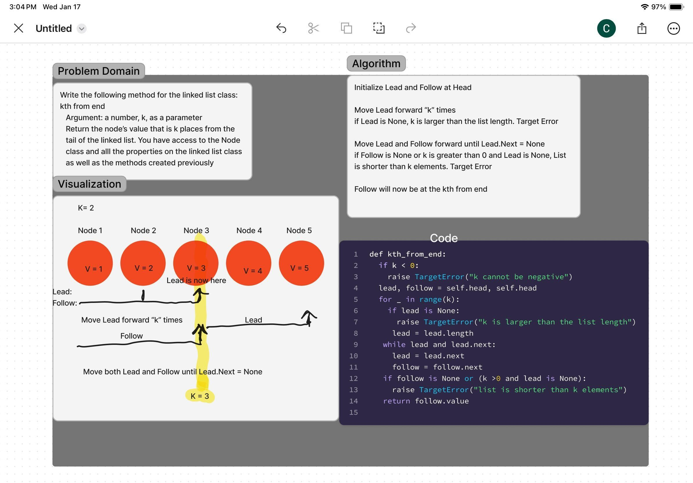

# Linked List Insertions
Write the following method for the Linked List class:

kth from end
    argument: a number, k, as a parameter.
    
    Return the node’s value that is k places from the tail of the linked list.
    You have access to the Node class and all the properties on the Linked List class as well as the methods created in previous challenges.

## Whiteboard Process

## Approach & Efficiency
<!-- What approach did you take? Why? What is the Big O space/time for this approach? -->
Research first. Initialize Lead and Follow at head. Move Lead forward "k" times. Then move both Lead and Follow forward until Lead is at the tail of the list or Lead.Next is None. Follow should now be at the desired node so Follow.value is your answer

Big O considerations:
Time: O(n) -- linear in respect to length of nodes
Space: O(1) -- the method uses a fixed number of pointers, lead and follow, and does not depend on the size of the input list

## Solution

[Link to Code](../../data_structures/linked_list.py)

# Test the function with the provided examples

Tests:
     tests/code_challenges/test_linked_list_kth.py

# Example usage

head -> {1} -> {3} -> {8} -> {2} -> X	0	2

head -> {1} -> {3} -> {8} -> {2} -> X	2	3

head -> {1} -> {3} -> {8} -> {2} -> X	6	Exception