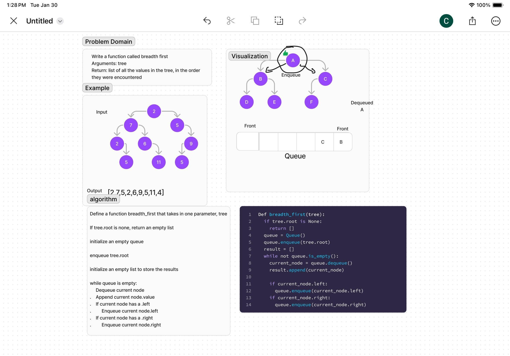

# Tree Breadth First
Write a function called breadth first
Arguments: tree
Return: list of all values in the tree, in the order they were encountered

## Whiteboard Process

## Approach & Efficiency

Initialize an empty queue
enqueue tree.root
initialize empty results list
while queue is not empty
    dequeue current node
append current node to results
if current node has a .left
    enqueue node.left
if current node has a .right
    enqueue node.right

Big O:
    Time: O(n) -- linear to amount of nodes
    
    Space: O(n) -- linear to number of nodes

## Solution

[Link to Code](../../code_challenges/tree_breadth_first.py)

# Example usage
        5         
       / \        
      4     8     
     /     / \    
  11     13    4  
 /  \         / \ 
7    2       5   1

result = [5,4,8,11,13,4,7,2,5,1]
